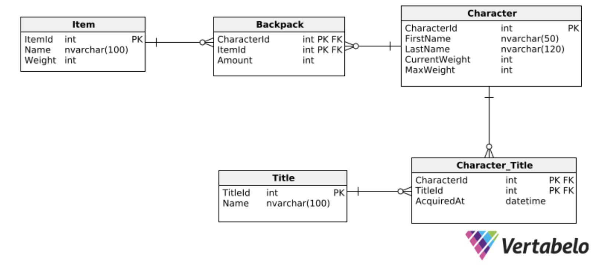

# 🎭 Character Items – API

Character Items is a lightweight academic REST API developed for university-level software testing and design exercises. It simulates a relationship between game characters and their inventory items in a structured and interactive way.


---

## 🛠️ Getting Started

### Clone the Repository

```bash
git clone https://github.com/antonio-backnotfront/character-items-api/
cd character-items-api
```

## 🤖 Configuration
Create an appsettings.json file in the project root with the following structure:
```json
{
  "Logging": {
    "LogLevel": {
      "Default": "Information",
      "Microsoft.AspNetCore": "Warning"
    }
  },
  "ConnectionStrings": {
    "DefaultDatabase": "Server=your_server;Database=your_db;User=placeholder;Password=placeholder;"
  }
}
```

## 📊 Database Schema

A preview of the EF Core Code-First schema used in the project:


## 🔗 Endpoints Overview

```http request
GET /api/characters/{Id}
```
- Retrieves detailed information about a specific character based on their unique ID. The response includes character attributes such as name, inventory, and carrying capacity. 

Example response body:
```json
{
  "firstName": "John",
  "lastName": "Yakuza",
  "currentWeight": 43,
  "maxWeight": 200,
  "backpackItems": [
    {
      "itemName": "Item1",
      "itemWeight": 10,
      "amount": 2
    }, {
      "itemName": "Item2",
      "itemWeight": 11,
      "amount": 1
    }, {
      "itemName": "Item3",
      "itemWeight": 12,
      "amount": 1
    } ],
  "titles": [ {
    "title": "Title1",
    "aquiredAt": "2024-06-10T00:00:00" },
    {
      "title": "Title2",
      "aquiredAt": "2024-06-09T00:00:00"
    }, {
      "title": "Title3",
      "aquiredAt": "2024-06-08T00:00:00" }
  ] }
```

---
```http request
POST /api/characters/{characterId}/backpacks
```
Allows adding new items to a character’s inventory by sending a list of item IDs. The request must pass several checks:

- ✅ All specified item IDs must exist in the database. 
- ✅ The character must have enough free carrying capacity for the total weight of the items.
- ✅ On success, the items are added, and the character’s total carried weight is updated.
  Example request body:
```json
[
  1, 
  2
]
```
## 📌 Tech Stack

- **ASP.NET Core Web API** – Backend framework for building the REST API.
- **Entity Framework Core (Code-First)** – ORM used to map C# classes to SQL tables.
- **SQL Server** – Relational database for storing characters and items.

